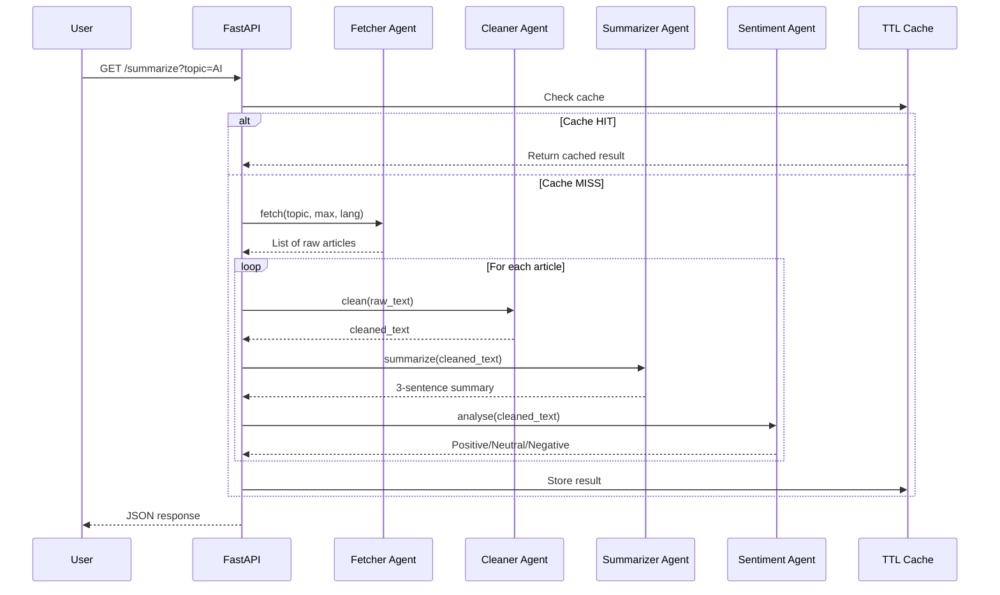

# 🤖 Agents Documentation

This document describes each agent in the **Smart News Summarizer** multi-agent pipeline.

---

## Pipeline Overview

```
┌─────────────┐    ┌──────────────┐    ┌──────────────────┐    ┌────────────────┐
│   Agent 1   │───▶│   Agent 2    │───▶│     Agent 3      │───▶│    Agent 4     │
│   Fetcher   │    │   Cleaner    │    │   Summarizer     │    │   Sentiment    │
│  (NewsAPI)  │    │ (Rule-based) │    │ (Ollama LLM)     │    │ (Ollama LLM)  │
└─────────────┘    └──────────────┘    └──────────────────┘    └────────────────┘
     Input:              Input:              Input:                  Input:
     Topic               Raw text            Clean text              Clean text
     
     Output:             Output:             Output:                 Output:
     Article list        Clean text          3-sentence summary      Pos/Neu/Neg
```

---

## Agent 1 — Fetcher Agent

**File:** `agents/fetcher.py`

### Responsibility
Calls the NewsAPI REST API to fetch the latest articles for a given search topic.

### Input
| Parameter | Type | Description |
|-----------|------|-------------|
| `topic` | `str` | Search keyword (e.g., "Tesla") |
| `max_articles` | `int` | Maximum number of articles to fetch |
| `language` | `str` | Language code (e.g., "en") |

### Output
A Python `list[dict]` where each dictionary contains raw article fields from NewsAPI:
- `title` — Headline
- `description` — Short blurb
- `content` — Truncated article body
- `source` — `{ "name": "..." }`
- `url` — Link to the original article
- `publishedAt` — ISO timestamp

### Technology
- **NewsAPI REST API** via `httpx` (async)
- Filters out removed/empty articles automatically

### Error Handling
- Raises `ValueError` if `NEWS_API_KEY` is not configured
- Raises `httpx.HTTPStatusError` on non-2xx responses

---

## Agent 2 — Cleaner Agent

**File:** `agents/cleaner.py`

### Responsibility
Sanitizes raw article text before sending it to the LLM. This is a **rule-based** agent — no AI model is used.

### Cleaning Steps

| Step | What it removes | Regex / Method |
|------|----------------|----------------|
| 1 | HTML tags | `<[^>]+>` → space |
| 2 | HTML entities | `&amp;`, `&lt;`, `&nbsp;` etc. |
| 3 | URLs | `https?://\S+` |
| 4 | NewsAPI truncation markers | `[+1234 chars]` |
| 5 | Excessive whitespace | `\s+` → single space |
| 6 | Leading / trailing space | `.strip()` |

### Input
| Parameter | Type | Description |
|-----------|------|-------------|
| `text` | `str` | Raw concatenated article text |

### Output
A clean `str` ready for LLM consumption.

### Technology
- Pure Python + `re` (regular expressions)
- Zero external dependencies

---

## Agent 3 — Summarizer Agent

**File:** `agents/summarizer.py`

### Responsibility
Generates a concise, exactly **3-sentence summary** of the cleaned article text using a local LLM via Ollama.

### Prompt Template

```
Summarize the following news article into exactly three concise sentences
written in simple English.

Article:
{article}

Do not invent facts.
```

### Input
| Parameter | Type | Description |
|-----------|------|-------------|
| `article_text` | `str` | Cleaned article text |

### Output
A plain English `str` containing a 3-sentence summary.

### Technology
- **Ollama** API (`/api/generate`)
- Model: `llama3.1:8b` (configurable)
- Async HTTP via `httpx`

### Error Handling
- Returns `"Summary could not be generated."` if the LLM returns an empty response
- Upstream callers catch exceptions and fall back gracefully

---

## Agent 4 — Sentiment Agent

**File:** `agents/sentiment.py`

### Responsibility
Classifies the sentiment of an article as one of three labels: **Positive**, **Neutral**, or **Negative**.

### Prompt Template

```
Classify the sentiment of the following news article.

Only answer with one word:
Positive
Neutral
Negative

Article:
{text}
```

### Input
| Parameter | Type | Description |
|-----------|------|-------------|
| `text` | `str` | Cleaned article text |

### Output
A single `str`: `"Positive"`, `"Neutral"`, or `"Negative"`.

### Fallback Logic

```python
1. Parse LLM response → strip & capitalize
2. If the result is NOT in {"positive", "neutral", "negative"}:
   a. Search the response for "positive" → return "Positive"
   b. Search the response for "negative" → return "Negative"
   c. Default to "Neutral"
```

### Technology
- **Ollama** API (`/api/generate`)
- Model: `llama3.1:8b` (configurable)
- Built-in validation with fuzzy extraction

---

## Agent Interaction Flow



---

## Configuration

All agents inherit their configuration from `config.py`, which reads from environment variables:

| Variable | Used by | Default |
|----------|---------|---------|
| `NEWS_API_KEY` | Fetcher Agent | *required* |
| `OLLAMA_BASE_URL` | Summarizer, Sentiment | `http://localhost:11434` |
| `OLLAMA_MODEL` | Summarizer, Sentiment | `llama3.1:8b` |

---

## Adding a New Agent

To extend the pipeline:

1. Create a new file in `agents/` (e.g., `agents/translator.py`)
2. Implement a single async function (e.g., `async def translate(text, target_lang)`)
3. Wire it into the processing loop in `app.py`
4. Add any new fields to `models/response.py`
5. Update the frontend card template in `script.js`

---

## Learning Outcomes

By studying these agents you will learn:

- ✅ How to decompose a complex task into single-responsibility agents
- ✅ Prompt engineering for summarisation and classification
- ✅ Integrating a local LLM via REST API
- ✅ Rule-based text preprocessing
- ✅ Error handling & fallback strategies in AI pipelines
- ✅ Caching to avoid redundant expensive operations
